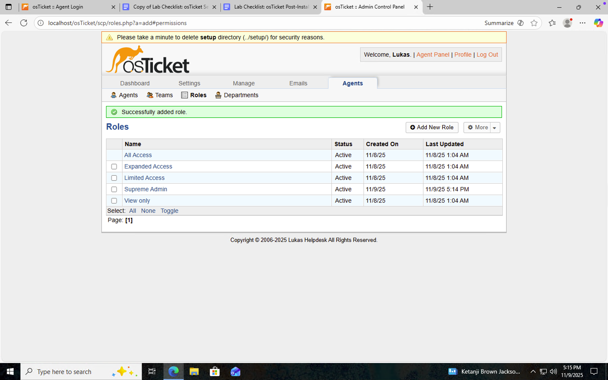
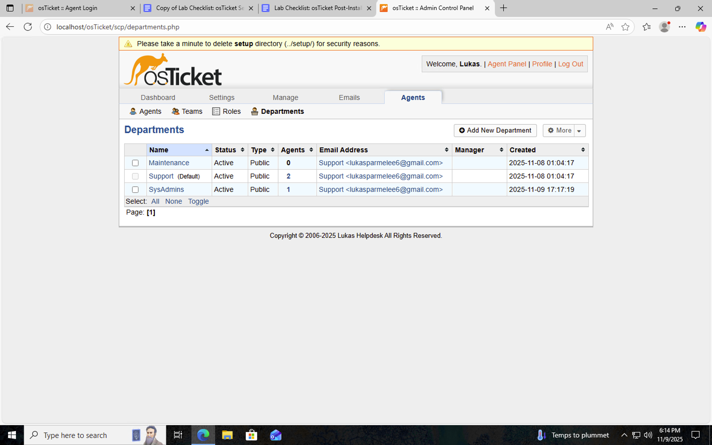
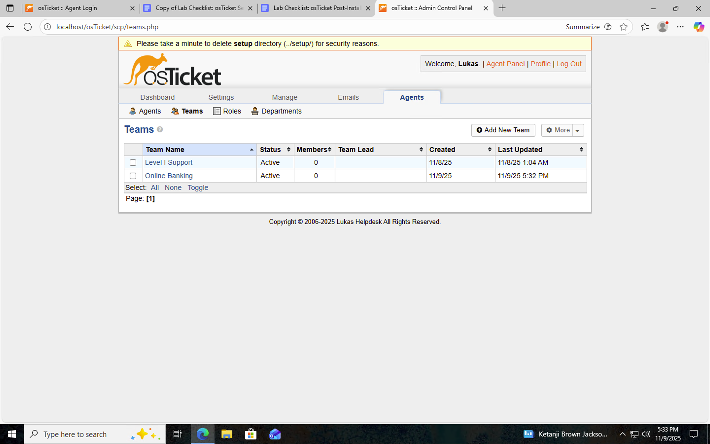
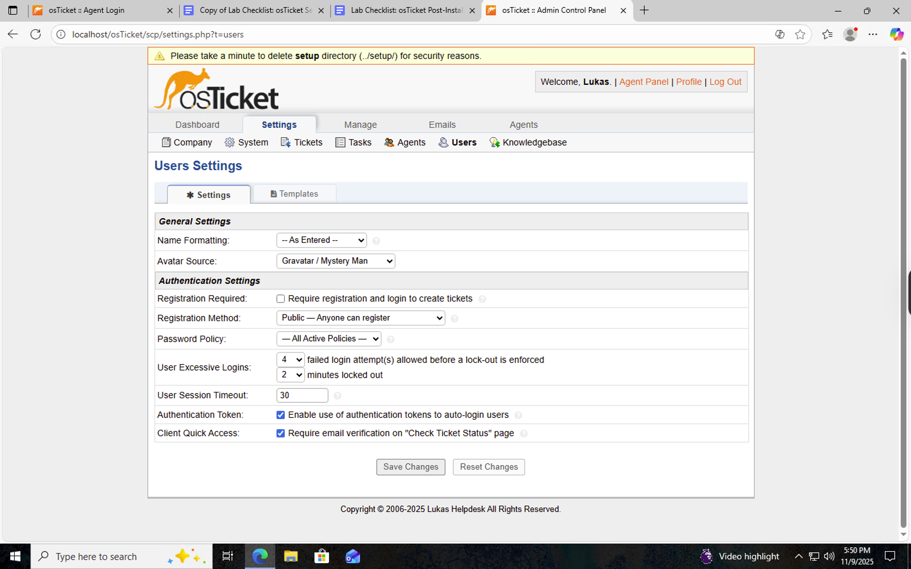
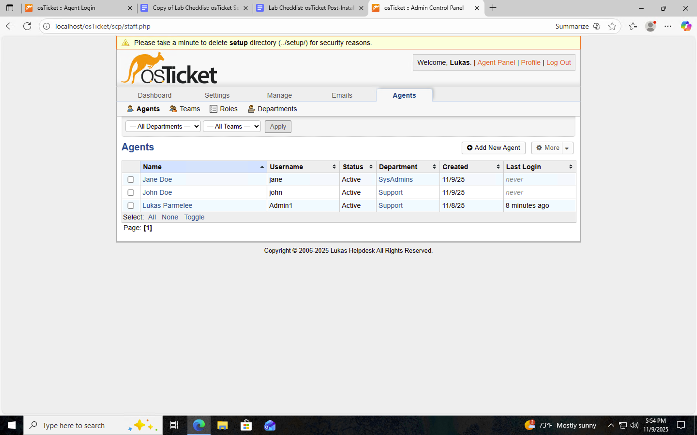
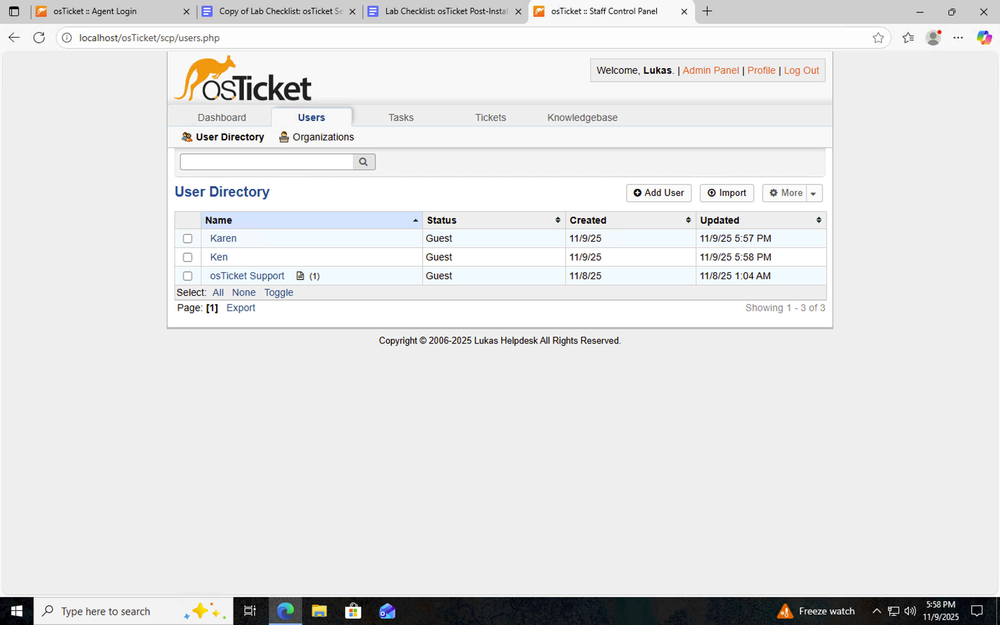
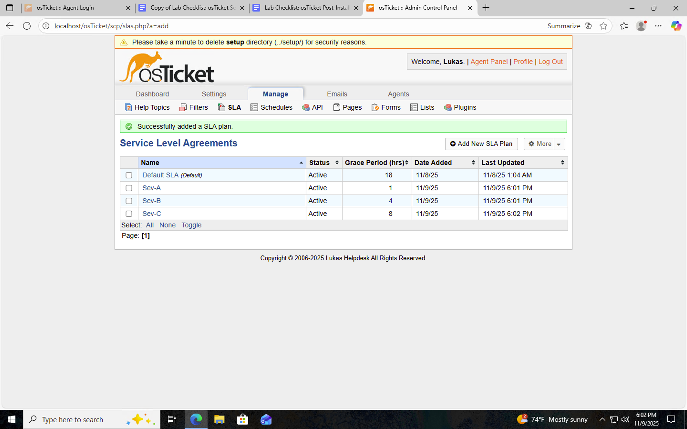
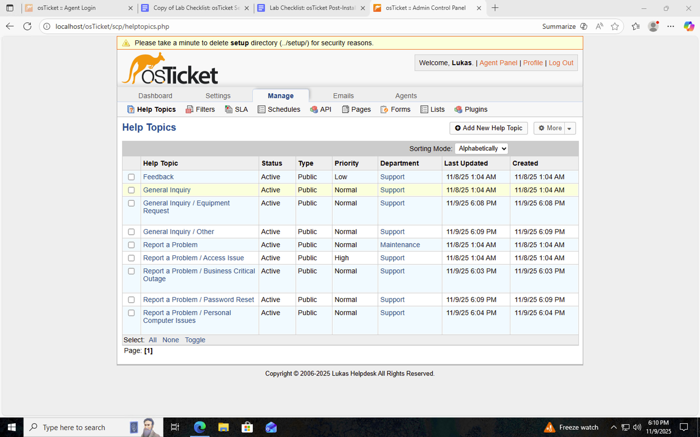

# osTicket - Post-Install Configuration

This tutorial outlines the **post-install configuration** of the open-source help desk ticketing system **osTicket**.  
The objective of this lab was to configure roles, departments, SLAs, help topics, and user access within the osTicket environment to simulate a functional IT support system.

---

### 🎥 Video Demonstration
**YouTube:** [How To Configure osTicket, Post-Installation](https://www.youtube.com/watch?v=)

---

### 🧰 Environments and Technologies Used
- Microsoft Azure (Virtual Machines/Compute)
- Remote Desktop (RDP)
- Internet Information Services (IIS)
- osTicket (Help Desk Ticketing System)

---

### 💻 Operating Systems Used
- Windows 10 (21H2)

---

### 🏁 Post-Install Configuration Objectives
1. Access and distinguish between the **Admin Panel** and **Agent Panel**  
2. Configure **Roles**, **Departments**, and **Teams** for ticket organization and workflow control  
3. Create **Agents** (staff) and **Users** (customers)  
4. Set up **SLA Plans** for response and resolution time management  
5. Add **Help Topics** to categorize ticket requests  

---

## ⚙️ Configuration Steps

### Step 1: Access the osTicket Panels
- **Admin/Analyst Login:** [http://localhost/osTicket/scp/login.php](http://localhost/osTicket/scp/login.php)  
- **End User Portal:** [http://localhost/osTicket](http://localhost/osTicket)

  

Understood the difference between:
- **Admin Panel:** for system configuration and settings  
- **Agent Panel:** for handling and managing support tickets  

---

### Step 2: Configure Roles

  

**Path:** Admin Panel → Agents → Roles  

Created a new role called **Supreme Admin**, granting full permissions for ticket management, configuration, and system settings.  
This role allows top-level administrative control over all osTicket features.

---

### Step 3: Configure Departments

  

**Path:** Admin Panel → Agents → Departments  

Added a department named **SysAdmins** to handle technical and backend issues.  
Departments determine ticket visibility and workflow, such as separating **Help Desk**, **SysAdmins**, and **Networking** responsibilities.

---

### Step 4: Configure Teams

  

**Path:** Admin Panel → Agents → Teams  

Created a **Team** named **Online Banking** to pull agents from multiple departments.  
Teams improve collaboration across different technical groups and allow shared ticket responsibilities.

---

### Step 5: Configure User Settings

  

**Path:** Admin Panel → Settings → User Settings  

Updated registration settings to:
- **Require registration and login** to create tickets  
- **Unchecked** the option allowing unregistered users to create tickets  

This ensures only verified users can submit support requests.

---

### Step 6: Configure Agents (Support Staff)

  

**Path:** Admin Panel → Agents → Add New  

Created the following agents:  
- **Jane** — Assigned to **SysAdmins Department**  
- **John** — Assigned to **Support Department**  

Agents represent internal IT staff responsible for resolving tickets.

---

### Step 7: Configure Users (End Users)

  

**Path:** Agent Panel → Users → Add New  

Added two users (customers):  
- **Karen**  
- **Ken**  

End users submit tickets via the user portal and receive responses from agents.

---

### Step 8: Configure SLA Plans

  

**Path:** Admin Panel → Manage → SLA  

Configured three SLA plans to manage response and resolution expectations:

| SLA Plan | Grace Period | Schedule |
|-----------|---------------|-----------|
| Sev-A | 1 hour | 24/7 |
| Sev-B | 4 hours | 24/7 |
| Sev-C | 8 hours | Business Hours |

SLAs ensure timely support based on ticket priority.

---

### Step 9: Configure Help Topics

  

**Path:** Admin Panel → Manage → Help Topics  

Created Help Topics to categorize tickets:
- Business Critical Outage  
- Personal Computer Issues  
- Equipment Request  
- Password Reset  
- Other  

These topics route tickets to the appropriate departments or teams automatically.

---

### 🧹 Disk Sanitization
After completing the configuration, the Azure virtual machine was deleted to ensure all temporary data and credentials were securely removed.

---

## 🧾 Summary

This lab completed the **post-install configuration** of osTicket, transforming it into a fully operational help desk system.  
By configuring users, SLAs, roles, and ticket topics, this project demonstrates the ability to manage IT service environments and implement workflow automation within an enterprise support system.

---

### 🧠 Skills Demonstrated
- osTicket Administration & Configuration  
- Azure Virtual Machine Management  
- IIS and Web Server Integration  
- User Account & Role Management  
- Service Level Agreement Implementation  
- ITSM Workflow Design
